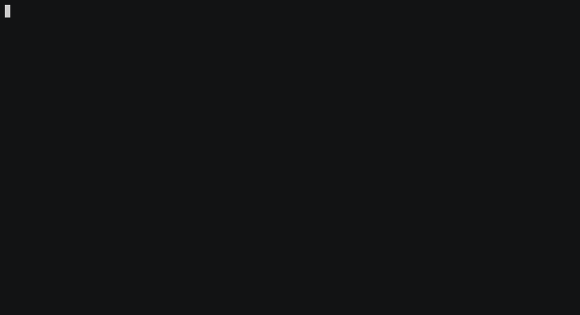

# crap: Composer Require Aliased Packages

[![Latest Version on Packagist][ico-version]][link-packagist]
[![Software License][ico-license]](LICENSE.md)
[![Build Status][ico-travis]][link-travis]
[![Coverage Status][ico-coveralls]][link-coveralls]
[![Quality Score][ico-code-quality]][link-code-quality]
[![Total Downloads][ico-downloads]][link-downloads]

Define aliases for your favorite packages, making usage as simple as `crap require monolog`.



## Install

PHP 5.6+ or 7.0+ required.

Because using multiple global Composer packages can create dependency conflicts, I recommend using [`consolidation/cgr`](//github.com/consolidation/cgr) over `composer global require`:

``` bash
cgr --stability dev geekish/crap
```

If you _don't_ mind descending into global dependency hell:

``` bash
composer global require geekish/crap
```

## Usage

To define your aliases (version constraints are optional):

``` bash
crap alias monolog monolog/monolog:^1.21
```

To use your aliases:

``` bash
crap require monolog
crap update monolog
crap remove monolog
```

To remove an alias:

``` bash
crap unalias monolog
```

View a list of defined alias:

``` bash
crap list
```

These commands simply find your aliases, and call the Composer commands with the real package names.
If you provided a version constraint when defining your alias, `crap` will use this by default.
You may provide a version constraint on the require and update commands; this will override any default.

The commands `require`, `update`, and `remove` all accept the same options/flags as the Composer commands that they call.
For reference, see Composer's [Commands documentation][link-composer-docs].

## Why?

I'm lazy.
I tried to create global shell aliases for packages that I used often.
It worked, but if I typed out the full package name, I would get `monolog/monolog/monolog/monolog`.
I also tried to write a Composer plugin, but there was no way to override the incoming package argument.
So, I wrote `crap`.

Oh, the name?
I was going to call it `cra`, and call the main class `Crapp`.
Then I thought of the acronym, and it was just too good not to use.

Yes, it is totally inspired by Spongebob's [POOP].

## Change log

Please see [CHANGELOG](CHANGELOG.md) for more information what has changed recently.

## Testing

After a composer install, to run the unit tests via `phpunit`:

``` bash
composer test
```

## Contributing

Please see [CONTRIBUTING](CONTRIBUTING.md) and [CONDUCT](CONDUCT.md) for details.

## Security

If you discover any security related issues, please email hannahwarmbier@gmail.com instead of using the issue tracker.

## Credits

- [asciinema] & [asciinema2gif] - for the terminal recording
- [consolidation/cgr] - for the inspiration to write this.
- [Contributors]

## License

The MIT License (MIT). Please see [License File](LICENSE.md) for more information.

[ico-version]: https://img.shields.io/packagist/v/geekish/crap.svg?style=flat-square
[ico-license]: https://img.shields.io/badge/license-MIT-brightgreen.svg?style=flat-square
[ico-travis]: https://img.shields.io/travis/geekish/crap/master.svg?style=flat-square
[ico-coveralls]: https://coveralls.io/repos/github/geekish/crap/badge.svg
[ico-code-quality]: https://img.shields.io/scrutinizer/g/geekish/crap.svg?style=flat-square
[ico-downloads]: https://img.shields.io/packagist/dt/geekish/crap.svg?style=flat-square

[link-packagist]: https://packagist.org/packages/geekish/crap
[link-travis]: //travis-ci.org/geekish/crap
[link-coveralls]: //coveralls.io/github/geekish/crap
[link-code-quality]: //scrutinizer-ci.com/g/geekish/crap
[link-downloads]: https://packagist.org/packages/geekish/crap

[link-composer-docs]: //getcomposer.org/doc/03-cli.md

[contributors]: ../../contributors

[asciinema]: //asciinema.org/
[asciinema2gif]: //github.com/tav/asciinema2gif
[consolidation/cgr]: //github.com/consolidation/cgr
[poop]: //poop.urbanup.com/340199#.WC3kAiMiBbo.twitter
